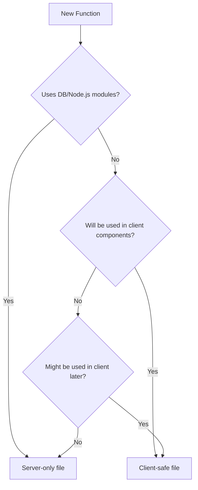

# Next.js Module Not Found Error: Resolution Guide

## Overview
This document details the resolution of "Module not found" errors that occur when Node.js-specific modules (like `fs`, `net`, `tls`, `perf_hooks`) are imported in client-side code in Next.js applications.

## The Problem

### Error Messages
```
Module not found: Can't resolve 'fs'
Module not found: Can't resolve 'net'
Module not found: Can't resolve 'tls'
Module not found: Can't resolve 'perf_hooks'
```

### Root Cause
These errors occurred because we were trying to use server-side functions that access the database (via Drizzle ORM and PostgreSQL client) directly in a client component. The database client libraries use Node.js-specific modules that don't exist in the browser environment.

### Specific Issue in Our Case
1. **Client Component**: `PostingSettingsStep.tsx` (marked with `'use client'`)
2. **Server Function**: `getActivePricing()` from `/lib/utils/pricing.ts`
3. **Problem**: The client component was directly importing and calling `getActivePricing()`, which uses:
   - `db()` function that creates a database connection
   - PostgreSQL client that requires Node.js modules (`fs`, `net`, `tls`, etc.)

## How We Fixed It

### 1. Separated Client and Server Code

#### Created Client-Safe Utilities
**File**: `/lib/utils/pricing-client.ts`
```typescript
// Client-safe pricing utility functions (no database access)

export const formatPrice = (priceInBututs: number, includeSymbol = true): string => {
  // Pure JavaScript function - safe for client
};

export const calculateTotalPrice = (pricePerMonth: number, durationInMonths: number): number => {
  // Pure calculation - safe for client
};

// Other pure functions...
```

#### Kept Server-Only Functions Separate
**File**: `/lib/utils/pricing.ts`
```typescript
import { db } from '@/lib/db';
// Server-only imports

export const getActivePricing = async () => {
  const database = await db(); // Database access - server only!
  // ...
};

// Re-export client-safe functions for backward compatibility
export { formatPrice, calculateTotalPrice } from './pricing-client';
```

### 2. Created Server Actions

**File**: `/app/(dashboard)/employer/jobs/new/_actions/pricing.ts`
```typescript
'use server'

import { getActivePricing } from '@/lib/utils/pricing'
import type { PricingConfig } from '@/lib/db/schema'

export async function fetchActivePricing(): Promise<PricingConfig | null> {
  try {
    const pricing = await getActivePricing()
    return pricing
  } catch (error) {
    console.error('Error fetching pricing:', error)
    return null
  }
}
```

### 3. Updated Client Components

**Before** (Causing Error):
```typescript
'use client'
import { getActivePricing } from '@/lib/utils/pricing' // ❌ Server function in client!

export default function PostingSettingsStep() {
  useEffect(() => {
    const pricing = await getActivePricing() // ❌ Database access in browser!
  }, [])
}
```

**After** (Fixed):
```typescript
'use client'
import { formatPrice, calculateTotalPrice } from '@/lib/utils/pricing-client' // ✅ Client-safe
import { fetchActivePricing } from '../../_actions/pricing' // ✅ Server action

export default function PostingSettingsStep() {
  useEffect(() => {
    const pricing = await fetchActivePricing() // ✅ Calls server action
  }, [])
}
```

## Best Practices to Avoid This Error

### 1. Identify Server vs Client Code

**Server-Only Code** (cannot be used in client components):
- Database queries (`db()`, Drizzle ORM operations)
- File system operations (`fs` module)
- Environment variables without `NEXT_PUBLIC_` prefix
- Direct API calls to external services with secret keys
- Any code using Node.js-specific modules

**Client-Safe Code** (can be used anywhere):
- Pure JavaScript functions
- React hooks
- Browser APIs (localStorage, fetch, etc.)
- UI logic and state management

### 2. File Organization Pattern

```
lib/
├── utils/
│   ├── pricing.ts          # Server-only functions (DB access)
│   └── pricing-client.ts   # Client-safe functions
│
app/
├── (dashboard)/
│   └── employer/
│       └── jobs/
│           ├── _actions/   # Server actions (marked 'use server')
│           │   └── pricing.ts
│           └── _components/  # Client components
│               └── PostingSettingsStep.tsx
```

### 3. Decision Tree for Function Placement



### 4. Server Actions Pattern

When client components need server data:

1. **Create a Server Action**:
   ```typescript
   // _actions/data.ts
   'use server'
   
   export async function fetchServerData() {
     const data = await serverOnlyFunction()
     return data
   }
   ```

2. **Use in Client Component**:
   ```typescript
   // _components/ClientComponent.tsx
   'use client'
   
   import { fetchServerData } from '../_actions/data'
   
   export function ClientComponent() {
     const [data, setData] = useState(null)
     
     useEffect(() => {
       fetchServerData().then(setData)
     }, [])
   }
   ```

### 5. Common Patterns in Our Codebase

#### For Pricing/Payment Features
- **Client utilities**: Format prices, calculate totals, validate amounts
- **Server utilities**: Fetch pricing config, update database, process payments
- **Server actions**: Bridge between client components and server utilities

#### For Data Fetching
- **_queries.ts**: Server-only database queries
- **_actions.ts**: Server actions that call queries
- **_components/**: Client components that call server actions

### 6. TypeScript Types

Types can be shared between client and server:
```typescript
// Can be imported anywhere
import type { PricingConfig } from '@/lib/db/schema'
```

## Debugging Tips

### 1. Check the Import Chain
If you see "Module not found" for Node.js modules:
1. Look at the error stack trace
2. Find which file is trying to import the Node.js module
3. Trace back through imports to find where a client component imports server code

### 2. Use Next.js Build to Catch Errors
```bash
pnpm build
```
This will catch module resolution errors that might not appear in development.

### 3. Look for These Warning Signs
- Client component importing from `/lib/db/`
- Client component importing functions that use `await db()`
- Direct database queries in components under `_components/` folders
- Functions using `process.env` (without `NEXT_PUBLIC_`) in client components

## Summary

The key principle is **separation of concerns**:
- **Client components** handle UI and user interactions
- **Server actions** handle data fetching and mutations
- **Server utilities** handle database operations and Node.js-specific tasks
- **Client utilities** handle pure JavaScript operations

By following this pattern, we ensure that Node.js-specific code never attempts to run in the browser, preventing "Module not found" errors while maintaining a clean architecture.